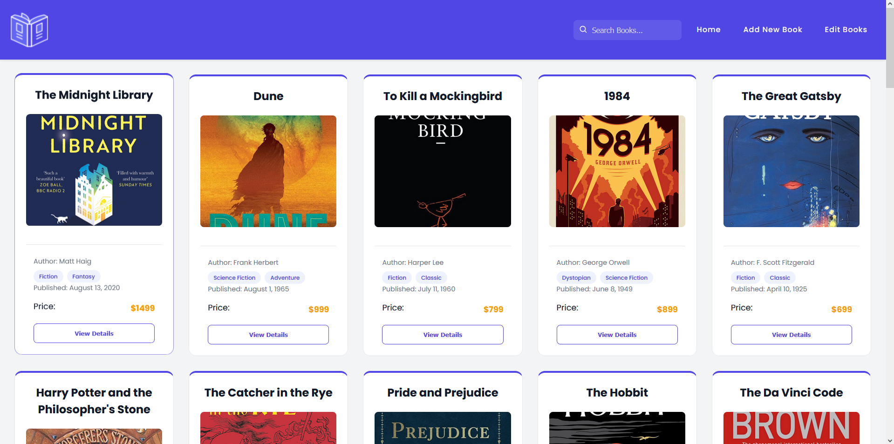

This project is a web-based **Book Management Application** built with Angular. It allows users to view, search, and manage a collection of books with modern UI/UX design and reactive programming principles.

## Features

- Browse a list of books
- Add a new book via form
- View  book details
- Caching with LocalStorage to reduce HTTP calls

## Screenshots

### Home Page (Books List)

### Book Details Page

### Add Book Page

### More Book Cards

